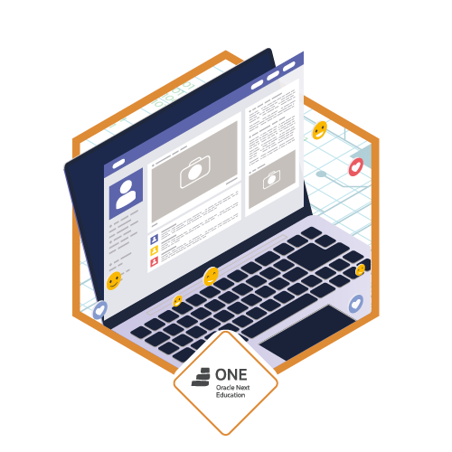

# Portafolio-Web

## ¡Bienvenidos y Bienvenidas a mí portafolio web! 🚀

  

 
El portafolio Web esta desarrollado con HTML5, CSS3, JAVASCRIPT, Bootstrap4 & Jquery.

### `Descripción`

 El portafolio web es una Landing Page, donde podrás encontrar información acerca de mí, un porcentaje de habilidades profesionales y habilidades técnicas que poseo actualmente, educación y experiencia laboral, encontraras una galería de proyectos elaborados con diferentes tipos de tecnologías utilizadas que son muy demandas hoy en día en el mercado laboral y un formulario de contacto o redes sociales, donde podemos conversar mas detalladamente sobre cada uno de mis proyectos.

 **Nota: El portafolio web se puede ver desde cualquier dispositivo ya sea Tablet o Móvil!**

 ## Redes Sociales

Si te gustaron mis proyectos y los trabajos que e realizado, dale una estrella a mi portafolio, si tienes dudas o sugerencias y quieres charlar conmigo hacerca de mis proyectos y las tecnologías que manejo, me puedes agregar a tus contactos o seguirme en mis redes sociales [LInkedin](https://www.linkedin.com/in/otorres-38a6241a2/) [Github](https://github.com/Otorres851), un cordial saludo.

## Referencias

  

El portafolio web fue desarrollado utilizando los conocimientos y las tecnologías aprendidas durante los 6 meses de estudio en el programa ONE de [Oracle](https://www.oracle.com/co/education/oracle-next-education/) y [Alura Latam](http://www.aluracursos.com). 

